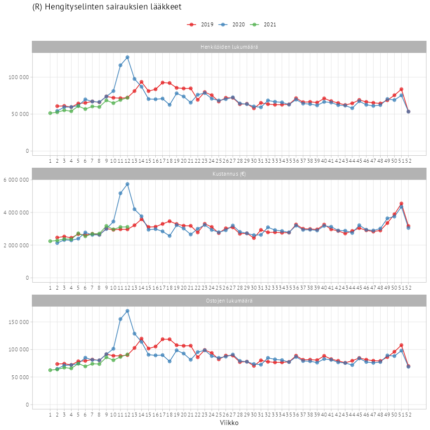

<br/>


# Reseptilääkkeiden ostot ATC-luokituksen mukaisesti

## Aineiston kuvaus

Sairausvakuutus maksaa korvausta niiden reseptilääkkeiden
kustannuksista, joille on vahvistettu korvattavuus ja kohtuullinen
tukkuhinta. Lisäksi korvataan lääkkeitä vastaavien valmisteiden
kustannuksia. Lääkkeitä vastaavia valmisteita ovat eräiden vaikeiden
sairauksien hoidossa käytettävät kliiniset ravintovalmisteet ja
pitkäaikaisen ihotaudin hoitoon käytettävät perusvoiteet.

Aineistosta on poistettu ne lääkeaineet, joita on yhtenä tai useampana
viikkona ostanut alle 10 henkilöä.

Aineistossa on mukana tarkastelujakson aikana ostettujen, apteekkien
välityksellä korvattujen lääkkeiden ja vastaavien valmisteiden tiedot
atc-luokan ja sairaanhoitopiirin mukaan viikkotasolla sisältäen
seuraavat muuttujat:

| CODE             | CLASS     | NAME                         | DESCRIPTION                                                                                                                                                                                                                                               |
| :--------------- | :-------- | :--------------------------- | :-------------------------------------------------------------------------------------------------------------------------------------------------------------------------------------------------------------------------------------------------------- |
| ALUEKOODI        | numeric   | Alueen koodi                 | Koko Suomen koodi on 99. SHP-koodit Tilastokeskuksen koodiston mukaiset SHP-tieto perustuu lääkkeen ostajan asuinkuntaan, joka vuoden 2019 osalta perustuu vuoden lopun tietoon ja vuoden 2020 osalta uusimpaan saatavilla olevaan tietoon.               |
| ALUENIMI\_EN     | character | Region name in English       | Region name in English                                                                                                                                                                                                                                    |
| ALUENIMI\_FI     | character | Alueen nimi suomeksi         | Koko Suomi tai sairaanhoitopiirin nimi. SHP-nimet Tilastokeskuksen koodiston mukaiset SHP-tieto perustuu lääkkeen ostajan asuinkuntaan, joka vuoden 2019 osalta perustuu vuoden lopun tietoon ja vuoden 2020 osalta uusimpaan saatavilla olevaan tietoon. |
| ALUENIMI\_SV     | character | Region name in Swedish       | Region name in Swedish                                                                                                                                                                                                                                    |
| ATC\_KOODI       | character | ATC-luokan koodi             | ATC-luokan koodi                                                                                                                                                                                                                                          |
| ATC\_SELITE\_EN  | character | ATC-luokan selite in English | ATC-luokan selite in English                                                                                                                                                                                                                              |
| ATC\_SELITE\_FI  | character | ATC-luokan selite            | ATC-luokan selite suomeksi                                                                                                                                                                                                                                |
| ATC\_SELITE\_SV  | character | ATC-luokan selite på Svenska | ATC-luokan selite på Svenska                                                                                                                                                                                                                              |
| ATC\_TASO        | numeric   | ATC-luokan taso              | ATC-luokan taso. Taso 0 tarkoittaa kaikkia reseptitietoja.                                                                                                                                                                                                |
| UPDATED          | character | Data päivitetty              | Data päivitetty                                                                                                                                                                                                                                           |
| VAR\_KUSTANNUS   | numeric   | Kustannus (€)                | Apteekkien välityksellä korvattujen, tarkastelujakson aikana ostettujen lääkkeiden kustannukset. Kustannuksella tarkoitetaan lääkkeen hinnasta ja apteekin toimitusmaksusta koostuvaa summaa, josta ei ole vielä vähennetty sairausvakuutuskorvausta      |
| VAR\_N\_HENKILOT | integer   | Henkilöiden lukumäärä        | Niiden henkilöiden lukumäärät, jotka ovat tarkastelujakson aikana ostaneet lääkkeitä. Nämä lääkeostot on joko korvattu apteekeissa tai niiden kustannukset ovat jääneet alle 50 euron omavastuun, jolloin ostot ovat vain kerryttäneet omavastuut         |
| VAR\_N\_OSTOT    | integer   | Ostojen lukumäärä            | Ostolla tarkoitetaan yhdellä kertaa apteekista toimitettua tietyn lääkevalmisteen erää. Vuodeksi määrätty lääkevalmiste kirjautuu tilastoon yleensä useana ostona, koska potilas noutaa lääkkeensä tavallisesti kolmen kuukauden välein                   |
| VIIKKO           | numeric   | Viikko                       | Vuoden viikko                                                                                                                                                                                                                                             |
| VUOSI            | numeric   | Vuosi                        | Vuosi                                                                                                                                                                                                                                                     |

## Aineiston käyttäminen

Sovelluksen käyttämä aineisto on vapaasti käytettävissä [Nimeä 4.0
Kansainvälinen (CC
BY 4.0)](https://creativecommons.org/licenses/by/4.0/deed.fi)-lisenssin
ehdoilla.

Klikkaa linkistä hiiren oikealla näppäimellä ja valitse “tallenna linkki
nimellä” ja anna tiedostopäätteeksi `csv`.

  - Lataa
    <a href="https://github.com/kelaresearchandanalytics/korona_atc_data/raw/master/data_viikko.csv" download="data_viikko.csv">data\_viikko.csv</a>
  - Lataa
    <a href="https://github.com/kelaresearchandanalytics/korona_atc_data/raw/master/metadata_viikko.csv" download="metadata_viikko.csv">metadata\_viikko.csv</a>

Aineisto päivittyy kerran viikossa keskiviikkoaamuisin.

## Käyttöesimerkki R-kielellä

**Datojen lataaminen**

``` r
df <- readr::read_csv2('https://github.com/kelaresearchandanalytics/korona_atc_data/raw/master/data_viikko.csv')
head(df)
#> # A tibble: 6 x 15
#>   VUOSI VIIKKO VAR_KUSTANNUS VAR_N_OSTOT VAR_N_HENKILOT ATC_KOODI ATC_SELITE_FI ATC_SELITE_SV
#>   <dbl>  <dbl>         <dbl>       <dbl>          <dbl> <chr>     <chr>         <chr>        
#> 1  2019      2     36375566.      956694         528534 <NA>      (NA) NA       (NA) NA      
#> 2  2019      3     36919671.      959393         526708 <NA>      (NA) NA       (NA) NA      
#> 3  2019      4     37345883.      945287         519017 <NA>      (NA) NA       (NA) NA      
#> 4  2019      5     39602251.      991698         540596 <NA>      (NA) NA       (NA) NA      
#> 5  2019      6     38800197.     1008379         550861 <NA>      (NA) NA       (NA) NA      
#> 6  2019      7     38803541.     1003305         551353 <NA>      (NA) NA       (NA) NA      
#> # … with 7 more variables: ATC_SELITE_EN <chr>, ALUEKOODI <dbl>, ATC_TASO <dbl>, ALUENIMI_FI <chr>,
#> #   ALUENIMI_SV <chr>, ALUENIMI_EN <chr>, UPDATED <dttm>
```

``` r
meta <- readr::read_csv2('https://github.com/kelaresearchandanalytics/korona_atc_data/raw/master/metadata_viikko.csv')
head(meta)
#> # A tibble: 6 x 6
#>   CODE     VALUES          CLASS  NAME        DESCRIPTION                          UPDATED            
#>   <chr>    <chr>           <chr>  <chr>       <chr>                                <dttm>             
#> 1 VAR_KUS… <NA>            numer… Kustannus … Apteekkien välityksellä korvattujen… 2020-08-26 08:45:07
#> 2 VAR_N_O… <NA>            integ… Ostojen lu… Ostolla tarkoitetaan yhdellä kertaa… 2020-08-26 08:45:07
#> 3 ALUEKOO… <NA>            numer… Alueen koo… Koko Suomen koodi on 99. SHP-koodit… 2020-08-26 08:45:07
#> 4 ATC_SEL… (NA) NA         chara… ATC-luokan… ATC-luokan selite in English         2020-08-26 08:45:07
#> 5 ATC_SEL… (A) Alimentary… chara… ATC-luokan… ATC-luokan selite in English         2020-08-26 08:45:07
#> 6 ATC_SEL… (B) Blood and … chara… ATC-luokan… ATC-luokan selite in English         2020-08-26 08:45:07
```

**Viivakuvio ATC-luokasta `R`**

``` r
library(ggplot2)
library(dplyr)
options(scipen = 999)
dat <- df %>% 
  filter(ALUEKOODI == 99,
         ATC_KOODI == "R") %>% 
  tidyr::pivot_longer(names_to = "muuttuja", 
                      values_to = "arvo", 
                      cols = starts_with("VAR_")) %>% 
  left_join(meta, by = c("muuttuja" = "CODE")) %>% 
  setNames(tolower(names(.)))

ggplot(dat, aes(x = viikko, y = arvo, color = factor(vuosi))) +
  geom_line() +
  geom_point(size = 2, alpha = .7) +
  facet_wrap(~name , scales = "free", ncol = 1) +
  scale_x_continuous(breaks = 1:max(dat$viikko)) +
        labs(fill = NULL, 
             color = NULL, 
             y = NULL,
             title = unique(dat$atc_selite_fi),
             x = "Viikko") +
        scale_fill_manual(values = c("#3F679F","#FDCA50")) +
        scale_color_manual(values = c("#3F679F","#FDCA50")) +
        theme_light(base_family = "PT Sans") +
        theme(legend.position = "top", 
              panel.grid.minor = element_blank()) +
        scale_y_continuous(labels = function(x) format(x, big.mark = " ",
                                                       scientific = FALSE),
                           limits = c(0,NA))
```

<!-- -->

**Kartta sairaanhoitopiireittäisestä ostomäärien suhteellisesta erosta
viikolla 12 ATC-luokassa `R`**

``` r
library(geofi)
dat <- df %>% 
  filter(ALUEKOODI != 99,
         VIIKKO == 12,
         ATC_KOODI == "R") %>% 
  select(-VAR_N_OSTOT,-VAR_N_HENKILOT) %>% 
  tidyr::pivot_wider(names_from = VUOSI, 
                      values_from = VAR_KUSTANNUS) %>% 
  mutate(`ero (%)` = round(`2020` / `2019` * 100, 1)-100) %>% 
  left_join(meta, by = c("ATC_KOODI" = "CODE")) %>% 
  setNames(tolower(names(.))) 

# Haetaan kuntadata ja aggregoidaan se sairaanhoitopiiritasolle
muni <- get_municipalities()
shp <- muni %>% 
  group_by(sairaanhoitop_code) %>% 
  summarise()

mapd <- left_join(shp,dat, by = c("sairaanhoitop_code" = "aluekoodi"))

ggplot(mapd, aes(fill = `ero (%)`, label = paste0(aluenimi_fi,"\n", `ero (%)`,"%"))) +
  geom_sf(color = alpha("white", 1/3)) +
  scale_fill_viridis_b() +
  theme_minimal(base_family = "PT Sans") +
  geom_sf_label(size = 3, color = "white", alpha = .7, family = "PT Sans") +
  theme(axis.text = element_blank(),
           axis.title = element_blank(),
           panel.grid = element_blank()) +
  labs(title = "ATC-luokan R (Hengityselinten sairauksien lääkkeet) kustannusten \nprosentuaalinen ero 2019 vs. 2020 viikolla 12",
       fill = "%")
```

<!-- -->

**Hajontakuvio sairaanhoitopiireittäisestä ostomäärien suhteellisesta
erosta viikolla 12 ATC-luokassa `R`**

``` r
library(geofi)
dat <- df %>% 
  filter(ALUEKOODI != 99,
         VIIKKO == 12,
         ATC_KOODI == "R") %>% 
  select(-VAR_N_OSTOT,-VAR_N_HENKILOT) %>% 
  tidyr::pivot_wider(names_from = VUOSI, 
                      values_from = VAR_KUSTANNUS) %>% 
  mutate(`ero (%)` = round(`2020` / `2019` * 100, 1)-100) %>% 
  left_join(meta, by = c("ATC_KOODI" = "CODE")) %>% 
  setNames(tolower(names(.))) 


# PXWEB query 
library(pxweb)
library(tidyr)
datplot <- pxweb_get(url = "http://pxnet2.stat.fi/PXWeb/api/v1/fi/Kuntien_avainluvut/2020/kuntien_avainluvut_2020_viimeisin.px",
            query = list("Alue 2020"=c("*"),
       "Tiedot"=c("M411","M478"))) %>% 
  as.data.frame(column.name.type = "text", variable.value.type = "text") %>% 
  pivot_wider(names_from = Tiedot, values_from = `Kuntien avainluvut`) %>% 
  left_join(geofi::municipality_key_2020, by = c("Alue 2020" = "name_fi")) %>% 
  group_by(sairaanhoitop_code) %>% 
  summarise(`Yli 64-vuotiaiden osuus väestöstä, %, 2019` = weighted.mean(x = `Yli 64-vuotiaiden osuus väestöstä, %, 2019`, 
                                                                         w = `Väkiluku, 2019`),
            `Väkiluku, 2019` = sum(`Väkiluku, 2019`)) %>% 
  left_join(dat, by = c("sairaanhoitop_code" = "aluekoodi"))
  


ggplot(datplot, aes(x = `Yli 64-vuotiaiden osuus väestöstä, %, 2019`, 
                    y = `ero (%)`, 
                    size = `Väkiluku, 2019`,
                    color = aluenimi_fi,
                    label = aluenimi_fi)) +
  geom_point(alpha = .7) +
  theme_light(base_family = "PT Sans") +
  ggrepel::geom_label_repel(size = 3, family = "PT Sans") +
  scale_radius(range=c(1, 30)) +
  theme(legend.position = "none") +
  labs(title = "ATC-luokan R (Hengityselinten sairauksien lääkkeet) kustannusten \nprosentuaalisen eron (2019 vs. 2020) viikolla 12 ja \nyli 64-vuotiaiden väestöosuuden (2019) yhteys sairaanhoitopiireittäin",
       subtitle = "Pisteen koko on sairaanhoitopiirin väestömäärä")
```

<!-- -->
